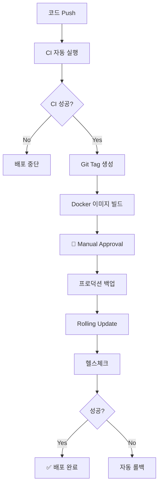

# GitHub Actions 워크플로우 가이드

## 📚 목차

- [빠른 시작](#-빠른-시작)
- [워크플로우 목록](#-워크플로우-목록)
- [설정 가이드](#-설정-가이드)
- [배포 가이드](#-배포-가이드)
- [트러블슈팅](#-트러블슈팅)

---

## 🚀 빠른 시작

### 1단계: SSH Key 생성

```bash
# 서버에서 실행
ssh gijunpark@172.30.1.79
ssh-keygen -t ed25519 -C "github-actions" -f ~/.ssh/github_actions
cat ~/.ssh/github_actions.pub >> ~/.ssh/authorized_keys
cat ~/.ssh/github_actions  # 내용 복사
```

### 2단계: GitHub Secrets 설정

1. Repository → Settings → Secrets and variables → Actions
2. New repository secret → `SSH_PRIVATE_KEY` (private key 내용 붙여넣기)

### 3단계: GitHub Environments 생성

1. Repository → Settings → Environments
2. 다음 3개 환경 생성 (모두 Required reviewers 설정):
   - `production`
   - `production-approval`
   - `production-rollback`

### 4단계: 첫 배포

```bash
git tag -a v1.0.0 -m "First production release"
git push origin v1.0.0
# GitHub Actions에서 승인 후 배포 완료!
```

자세한 설명은 [QUICKSTART.md](QUICKSTART.md) 참조

---

## 📋 워크플로우 목록

### 1. CI - Continuous Integration
**파일:** `.github/workflows/ci.yml`  
**트리거:** 모든 브랜치 push, Pull Request  
**설명:** 코드 품질 검사 및 빌드

```yaml
Jobs:
  - test-backend: 백엔드 단위 테스트 (PostgreSQL, MongoDB, Redis)
  - build-backend: 모든 백엔드 서비스 JAR 빌드
  - lint-frontend: ESLint, TypeScript 타입 체크
  - build-frontend: SvelteKit 프로덕션 빌드
  - ci-summary: CI 결과 요약
```

### 2. Deploy to Production
**파일:** `.github/workflows/deploy-production.yml`  
**트리거:** Git tag (v*.*.*), Manual workflow_dispatch  
**설명:** 프로덕션 배포 (수동 승인 필요)

```yaml
Jobs:
  1. validate: 버전 형식 검증
  2. build-and-push: Docker 이미지 빌드 & ghcr.io에 푸시
  3. manual-approval: 🚨 수동 승인 대기
  4. backup-production: DB 및 설정 백업
  5. deploy: Rolling update 배포
  6. health-check: 헬스체크
  7. smoke-test: 외부 URL 테스트
  8. rollback-on-failure: 실패시 자동 롤백
  9. deployment-summary: 배포 결과 요약
```

### 3. Rollback Deployment
**파일:** `.github/workflows/rollback.yml`  
**트리거:** Manual workflow_dispatch  
**설명:** 이전 버전으로 롤백

```yaml
Jobs:
  1. validate-rollback: 이미지 존재 확인
  2. backup-current: 현재 상태 백업
  3. manual-approval: 🚨 수동 승인 대기
  4. rollback: 롤백 실행
  5. health-check: 헬스체크 & 외부 URL 테스트
```

### 4. Security Scan
**파일:** `.github/workflows/security-scan.yml`  
**트리거:** Push, PR, 주 1회 자동, Manual  
**설명:** 보안 취약점 스캔

```yaml
Jobs:
  - trivy-container-scan: Docker 이미지 취약점 스캔
  - trivy-code-scan: 코드 취약점 스캔
  - dependency-check-backend: OWASP Dependency Check
  - dependency-check-frontend: npm audit
  - codeql-analysis: CodeQL 정적 분석
```

---

## 🔧 설정 가이드

### 필수 GitHub Secrets

| Secret 이름 | 설명 | 예시 |
|------------|------|------|
| `SSH_PRIVATE_KEY` | 서버 SSH private key (필수) | `-----BEGIN OPENSSH...` |
| `SLACK_WEBHOOK_URL` | Slack 알림 Webhook (선택) | `https://hooks.slack.com/...` |

### GitHub Environments

3개 환경 모두 **Required reviewers** 설정 필요:

1. **production**
   - 프로덕션 배포 최종 단계
   - URL: https://gijun.net

2. **production-approval**
   - 프로덕션 배포 수동 승인 단계

3. **production-rollback**
   - 롤백 수동 승인 단계

### 서버 환경

```bash
# 서버 정보
Host: 172.30.1.79
User: gijunpark
Path: ~/Stock-Simulator

# 필수 디렉토리
~/Stock-Simulator/          # 프로젝트 루트
~/production-backups/       # 배포 전 백업
~/rollback-backups/         # 롤백 전 백업

# 필수 파일
~/Stock-Simulator/.env      # 환경변수 설정
```

---

## 📦 배포 가이드

### 배포 플로우



### Git Tag로 배포 (권장)

```bash
# 1. 코드 커밋
git add .
git commit -m "feat: 새 기능 추가"
git push origin main

# 2. 태그 생성
git tag -a v1.0.0 -m "Release v1.0.0"
git push origin v1.0.0

# 3. GitHub Actions 확인
# https://github.com/<your-repo>/actions

# 4. Manual Approval 승인
# production-approval environment에서 승인

# 5. 배포 완료 확인
# https://gijun.net
```

### Manual Dispatch로 배포

1. GitHub → Actions → **Deploy to Production**
2. **Run workflow** 클릭
3. Version 입력 (예: `v1.0.0`)
4. **Run workflow** 클릭
5. Manual Approval 승인
6. 배포 진행

### 버전 규칙

- **형식:** `vX.Y.Z` (Semantic Versioning)
- **예시:**
  - `v1.0.0` - 첫 배포
  - `v1.0.1` - 버그 수정
  - `v1.1.0` - 새 기능 추가
  - `v2.0.0` - 호환성 없는 변경

---

## 🔄 롤백 가이드

### 롤백이 필요한 경우

- 배포 후 심각한 버그 발견
- 서비스 장애 발생
- 성능 문제 발생

### 롤백 실행

1. GitHub → Actions → **Rollback Deployment**
2. **Run workflow** 클릭
3. 입력 필드:
   - **version**: 롤백할 버전 (예: `v1.0.0`)
   - **reason**: 롤백 사유 (예: "Critical bug in payment")
4. **Run workflow** 클릭
5. Manual Approval 승인
6. 롤백 진행

### 롤백 후 확인

```bash
# 서버 접속
ssh gijunpark@172.30.1.79
cd ~/Stock-Simulator

# 컨테이너 상태 확인
docker-compose --profile all ps

# 로그 확인
docker logs stockSimulator-frontend -f
docker logs stockSimulator-api-gateway -f

# 외부 접근 테스트
curl https://gijun.net
curl https://api.gijun.net/actuator/health
```

---

## 🔍 모니터링

### GitHub Actions 로그

- Repository → **Actions** → 워크플로우 선택
- 각 Job 클릭하여 상세 로그 확인
- Summary에서 배포 결과 요약

### 서버 모니터링

#### Grafana Dashboard
- URL: http://172.30.1.79:3001
- 로그인: admin / stocksim123
- Dashboard: "Stock Simulator - Services Overview"

#### Prometheus Metrics
- URL: http://172.30.1.79:9091
- Targets: http://172.30.1.79:9091/targets

#### Eureka Service Registry
- URL: http://172.30.1.79:8761
- 모든 마이크로서비스 등록 상태 확인

### 서버 로그 확인

```bash
# 전체 서비스 상태
docker-compose --profile all ps

# 특정 서비스 로그
docker logs stockSimulator-<service-name> -f

# 최근 50줄 로그
docker logs stockSimulator-<service-name> --tail=50

# 로그 필터링 (에러만)
docker logs stockSimulator-<service-name> 2>&1 | grep ERROR
```

---

## 🆘 트러블슈팅

### CI 실패

#### Backend Tests 실패
```bash
# 로컬에서 테스트 실행
cd backend
./gradlew test

# 특정 서비스만 테스트
./gradlew :user-service:test
```

#### Frontend Build 실패
```bash
# 로컬에서 빌드 테스트
cd frontend
pnpm install
pnpm run check
pnpm run build
```

### 배포 실패

#### SSH 연결 실패
- GitHub Secret `SSH_PRIVATE_KEY` 확인
- 서버 방화벽 설정 확인
- SSH 포트 열려있는지 확인 (기본 22)

```bash
# 로컬에서 SSH 테스트
ssh gijunpark@172.30.1.79
```

#### Docker 이미지 Pull 실패
- GitHub Token 권한 확인
- GitHub Container Registry 접근 가능한지 확인

```bash
# 서버에서 수동 로그인 테스트
echo $GITHUB_TOKEN | docker login ghcr.io -u <username> --password-stdin
```

#### 헬스체크 실패
- 서비스가 정상적으로 시작되었는지 확인
- 대기 시간 충분한지 확인 (현재 60초)
- Eureka에 서비스 등록되었는지 확인

```bash
# 헬스체크 수동 확인
curl http://localhost:8761/actuator/health
curl http://localhost:9832/actuator/health
curl http://localhost:8080

# Eureka 등록 확인
curl http://localhost:8761/eureka/apps
```

### 롤백 실패

#### 이미지가 없는 경우
- 해당 버전의 이미지가 ghcr.io에 존재하는지 확인
- GitHub Packages에서 이미지 목록 확인

#### 수동 복구

```bash
# 서버 접속
ssh gijunpark@172.30.1.79
cd ~/Stock-Simulator

# 최신 백업 확인
ls -lt ~/production-backups/

# 백업에서 복구
BACKUP_DIR=~/production-backups/<latest-backup>
cp $BACKUP_DIR/.env .env
docker-compose --profile all down
docker-compose --profile all up -d
```

### 일반적인 문제

#### Kafka Cluster ID Mismatch
```bash
docker-compose --profile all down
docker volume rm stock-simulator_kafka_data stock-simulator_zookeeper_data
docker-compose --profile all up -d
```

#### PostgreSQL 연결 실패
```bash
# PostgreSQL 상태 확인
docker exec stockSimulator-postgres pg_isready -U stocksim

# 로그 확인
docker logs stockSimulator-postgres
```

#### Redis 연결 실패
```bash
# Redis 상태 확인
docker exec stockSimulator-redis redis-cli -a stocksim123 ping

# 로그 확인
docker logs stockSimulator-redis
```

---

## 📞 지원

### 도움이 필요하신가요?

- **GitHub Issues**: 버그 리포트 및 기능 요청
- **GitHub Discussions**: 질문 및 토론
- **Documentation**: [SETUP_GUIDE.md](SETUP_GUIDE.md), [QUICKSTART.md](QUICKSTART.md)

### 유용한 링크

- [GitHub Actions 문서](https://docs.github.com/en/actions)
- [Docker Compose 문서](https://docs.docker.com/compose/)
- [Spring Boot Actuator](https://docs.spring.io/spring-boot/docs/current/reference/html/actuator.html)
- [SvelteKit 문서](https://kit.svelte.dev/docs)

---

## 📜 변경 이력

### v1.0.0 (2026-01-29)
- ✨ CI 워크플로우 추가
- ✨ Production 배포 워크플로우 추가 (수동 승인 필요)
- ✨ Rollback 워크플로우 추가
- ✨ Security Scan 워크플로우 유지
- 📝 설정 가이드 작성
- 🔧 단일 프로덕션 서버 환경으로 최적화
