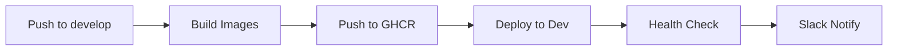
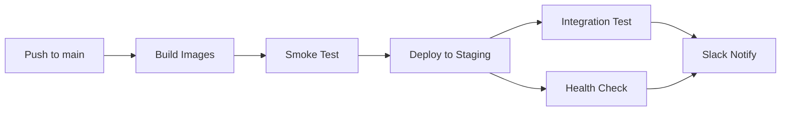
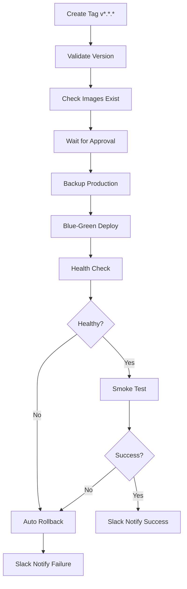
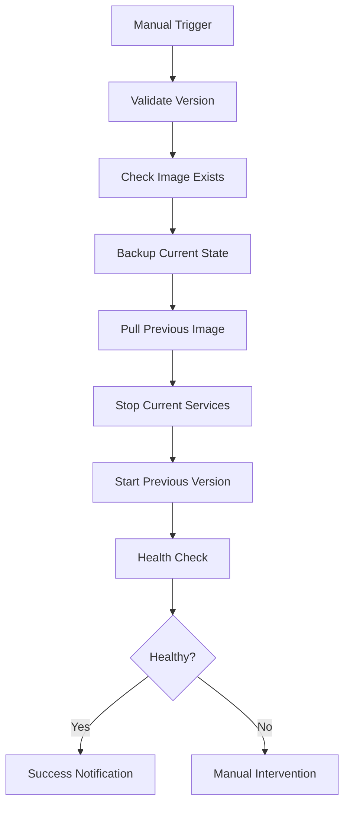

# CI/CD 가이드

Stock-Simulator 프로젝트의 CI/CD 파이프라인 완전 가이드입니다.

## 📋 목차

- [개요](#개요)
- [워크플로우 구조](#워크플로우-구조)
- [환경 설정](#환경-설정)
- [CI 파이프라인](#ci-파이프라인)
- [CD 파이프라인](#cd-파이프라인)
- [보안 스캔](#보안-스캔)
- [롤백 프로세스](#롤백-프로세스)
- [트러블슈팅](#트러블슈팅)

---

## 개요

### CI/CD 아키텍처

```
┌─────────────────────────────────────────────────────────────┐
│                      GitHub Actions                          │
├─────────────────────────────────────────────────────────────┤
│                                                              │
│  [develop] ──→ CI Backend ──→ Deploy Dev                    │
│                CI Frontend                                   │
│                Security Scan                                 │
│                                                              │
│  [main] ────→ CI Backend ──→ Deploy Staging                 │
│                CI Frontend                                   │
│                Security Scan                                 │
│                                                              │
│  [v*.*.*] ──→ Manual Approval ──→ Deploy Production         │
│                                    ├─→ Health Check          │
│                                    ├─→ Smoke Test            │
│                                    └─→ Auto Rollback         │
│                                                              │
│  Manual ────→ Rollback Workflow                              │
└─────────────────────────────────────────────────────────────┘
```

### 주요 특징

- ✅ **멀티 환경 지원**: Dev, Staging, Production
- ✅ **자동화된 테스트**: Unit, Integration, Smoke Tests
- ✅ **보안 스캔**: Trivy, OWASP, CodeQL, npm audit
- ✅ **무중단 배포**: Blue-Green 배포 전략 (Production)
- ✅ **자동 롤백**: 배포 실패 시 자동 복구
- ✅ **Slack 알림**: 배포 상태 실시간 알림

---

## 워크플로우 구조

### 1. CI 워크플로우

#### `ci-backend.yml`
- **트리거**: `backend/` 디렉토리 변경 시
- **실행 내용**:
  - PostgreSQL, MongoDB, Redis 서비스 시작
  - 전체 서비스 테스트 실행
  - 각 서비스별 JAR 빌드
  - 테스트 리포트 업로드

#### `ci-frontend.yml`
- **트리거**: `frontend/` 디렉토리 변경 시
- **실행 내용**:
  - ESLint 린팅
  - TypeScript 타입 체크
  - 프로덕션 빌드
  - 빌드 아티팩트 업로드

### 2. CD 워크플로우

#### `deploy-dev.yml`
- **트리거**: `develop` 브랜치 푸시
- **대상**: Development 서버
- **특징**:
  - 자동 배포 (승인 불필요)
  - 빠른 피드백
  - Docker 이미지 태그: `dev-latest`, `dev-{SHA}`

#### `deploy-staging.yml`
- **트리거**: `main` 브랜치 푸시
- **대상**: Staging 서버
- **특징**:
  - Smoke Test 실행
  - Integration Test 실행
  - 순차적 서비스 재시작 (Zero-downtime)
  - Docker 이미지 태그: `staging-latest`, `latest`

#### `deploy-prod.yml`
- **트리거**: `v*.*.*` 태그 생성
- **대상**: Production 서버
- **특징**:
  - **수동 승인 필수** (GitHub Environment Protection)
  - Production 데이터베이스 백업
  - Blue-Green 배포
  - 종합 Health Check
  - 실패 시 자동 롤백
  - Docker 이미지 태그: `v{VERSION}`

### 3. 보안 워크플로우

#### `security-scan.yml`
- **트리거**: 
  - Push to main/develop
  - Pull Request
  - 매주 월요일 오전 9시 (스케줄)
  - 수동 실행
- **스캔 항목**:
  - **Trivy Container Scan**: Docker 이미지 취약점
  - **Trivy Code Scan**: 코드 저장소 스캔
  - **OWASP Dependency Check**: Backend 의존성
  - **npm audit**: Frontend 의존성
  - **CodeQL**: 정적 코드 분석

### 4. 롤백 워크플로우

#### `rollback.yml`
- **트리거**: 수동 실행만 가능
- **입력 파라미터**:
  - `environment`: dev/staging/prod
  - `version`: 롤백할 버전 (Docker 이미지 태그)
  - `services`: 롤백할 서비스 (all 또는 개별)
  - `reason`: 롤백 사유
- **프로세스**:
  1. 이미지 존재 확인
  2. 현재 상태 백업
  3. 이전 버전으로 롤백
  4. Health Check
  5. Slack 알림

---

## 환경 설정

### 필수 GitHub Secrets

#### 공통
```bash
SSH_PRIVATE_KEY         # SSH 접속용 Private Key
GITHUB_TOKEN            # (자동 제공됨)
```

#### 환경별 서버 정보
```bash
# Development
DEV_SERVER_HOST         # Dev 서버 주소 (예: dev.example.com)
DEV_SERVER_USER         # Dev 서버 SSH 사용자 (옵션, 기본: SERVER_USER)

# Staging
STAGING_SERVER_HOST     # Staging 서버 주소
STAGING_SERVER_USER     # Staging 서버 SSH 사용자 (옵션)

# Production
PROD_SERVER_HOST        # Production 서버 주소 (또는 SERVER_HOST)
PROD_SERVER_USER        # Production 서버 SSH 사용자 (옵션)
SERVER_HOST             # Fallback Production 서버 (기존 호환성)
SERVER_USER             # Fallback SSH 사용자
```

#### 알림 (선택사항)
```bash
SLACK_WEBHOOK_URL       # Slack Incoming Webhook URL
```

### GitHub Variables

```bash
# API URLs
DEV_API_URL             # Dev 환경 API URL (예: http://dev-api.example.com)
STAGING_API_URL         # Staging 환경 API URL
VITE_API_URL            # Production 환경 API URL

# Service URLs
DEV_URL                 # Dev 서비스 URL
STAGING_URL             # Staging 서비스 URL
PROD_URL                # Production 서비스 URL

# Slack
SLACK_WEBHOOK_URL       # Slack Webhook (Variable로도 가능)
```

### GitHub Environments 설정

Production 배포를 위해 환경 설정이 필요합니다:

1. **Settings** → **Environments** → **New environment**
2. 다음 환경 생성:
   - `development`
   - `staging`
   - `production`
   - `production-approval` (수동 승인용)

3. **production-approval** 환경 설정:
   - ✅ **Required reviewers** 활성화
   - 승인자 추가 (최소 1명)
   - Deployment branch 제한: `refs/tags/v*`

---

## CI 파이프라인

### Backend CI

**경로**: `.github/workflows/ci-backend.yml`

#### 트리거 조건
```yaml
on:
  push:
    branches: [main, develop]
    paths:
      - 'backend/**'
      - '.github/workflows/ci-backend.yml'
  pull_request:
    branches: [main, develop]
    paths:
      - 'backend/**'
```

#### 실행 단계

1. **테스트 환경 구성**
   - PostgreSQL 16 Alpine
   - MongoDB 7
   - Redis 7 Alpine

2. **테스트 실행**
   ```bash
   ./gradlew test --parallel
   ```

3. **서비스별 빌드**
   - Gradle matrix strategy 사용
   - 9개 마이크로서비스 병렬 빌드
   ```bash
   ./gradlew :${service}:bootJar
   ```

4. **아티팩트 업로드**
   - 테스트 결과
   - 커버리지 리포트
   - JAR 파일 (7일 보관)

### Frontend CI

**경로**: `.github/workflows/ci-frontend.yml`

#### 트리거 조건
```yaml
on:
  push:
    branches: [main, develop]
    paths:
      - 'frontend/**'
      - '.github/workflows/ci-frontend.yml'
  pull_request:
    branches: [main, develop]
    paths:
      - 'frontend/**'
```

#### 실행 단계

1. **Lint & Type Check**
   ```bash
   pnpm run lint
   pnpm run check
   ```

2. **빌드**
   ```bash
   pnpm run build
   ```

3. **아티팩트 업로드**
   - 빌드 결과 (`frontend/build/`)

---

## CD 파이프라인

### Development 배포

**브랜치**: `develop`  
**서버**: Dev Server  
**자동화 수준**: 완전 자동

#### 배포 프로세스



#### 수동 실행
```bash
# GitHub Actions 탭에서
Actions → Deploy to Development → Run workflow
```

### Staging 배포

**브랜치**: `main`  
**서버**: Staging Server  
**자동화 수준**: 완전 자동

#### 배포 프로세스



#### 특징
- **순차적 재시작**: 서비스 간 의존성 고려
  ```
  eureka-server → 각 서비스 → frontend → api-gateway
  ```
- **Zero-downtime**: 서비스별 5초 간격 재시작

### Production 배포

**태그**: `v*.*.*` (예: `v1.0.0`)  
**서버**: Production Server  
**자동화 수준**: 수동 승인 필요

#### 배포 프로세스



#### 버전 태그 생성

1. **로컬에서 태그 생성**
   ```bash
   git tag -a v1.0.0 -m "Release v1.0.0"
   git push origin v1.0.0
   ```

2. **GitHub에서 Release 생성**
   - Releases → Create a new release
   - Tag: `v1.0.0`
   - Title: `Release 1.0.0`
   - Description: 변경사항 작성
   - Publish release

#### 수동 승인 프로세스

1. 워크플로우가 `production-approval` 단계에서 대기
2. 승인자에게 GitHub 알림 발송
3. **Actions** 탭에서 승인:
   - Review deployments
   - Approve deployment

#### Blue-Green 배포 전략

```yaml
# 1. 새 컨테이너 시작 (기존과 함께 실행)
docker-compose up -d --scale api-gateway=2

# 2. 30초 대기 & Health Check

# 3. 정상이면 기존 컨테이너 제거
docker-compose up -d --force-recreate

# 4. 실패하면 새 컨테이너만 제거 (롤백)
```

#### 자동 백업

배포 전 자동으로 백업:
- PostgreSQL 데이터베이스 덤프
- `.env` 설정 파일
- `docker-compose.yml`
- 현재 컨테이너 상태

백업 위치: `~/production-backups/{TIMESTAMP}_{VERSION}/`

---

## 보안 스캔

### Trivy Container Scan

모든 Docker 이미지의 취약점 스캔:
- **심각도**: CRITICAL, HIGH
- **결과**: GitHub Security 탭에 SARIF 업로드

### Trivy Code Scan

소스 코드 및 의존성 스캔:
- 파일시스템 스캔
- 설정 파일 검증
- 비밀키 유출 검사

### OWASP Dependency Check

Backend Gradle 의존성 분석:
```bash
./gradlew dependencyCheckAggregate
```
- CVE 데이터베이스 기반
- HTML 리포트 생성

### npm audit

Frontend 패키지 취약점 검사:
```bash
pnpm audit
```
- JSON 리포트 저장
- 30일 보관

### CodeQL Analysis

정적 코드 분석:
- **언어**: Java/Kotlin, JavaScript/TypeScript
- **쿼리**: Security + Quality
- **결과**: Security 탭 코드 스캔 알림

### 보안 스캔 실행

#### 자동 실행
- Push to main/develop
- Pull Request 생성
- 매주 월요일 오전 9시 (UTC 0시)

#### 수동 실행
```bash
Actions → Security Scan → Run workflow
```

### 보안 결과 확인

1. **Security** 탭 → **Code scanning alerts**
2. 심각도별 필터링
3. 각 알림의 상세 정보 확인
4. 수정 권장사항 적용

---

## 롤백 프로세스

### 언제 롤백이 필요한가?

- ❌ 배포 후 critical bug 발견
- ❌ 성능 저하
- ❌ 서비스 장애
- ❌ 데이터 무결성 문제

### 자동 롤백 (Production만)

Production 배포 시 Health Check 또는 Smoke Test 실패하면 자동으로 이전 상태로 복구:

```yaml
rollback-on-failure:
  if: failure()
  steps:
    - 최근 백업 찾기
    - 설정 파일 복원
    - 컨테이너 재시작
```

### 수동 롤백

#### 1. GitHub Actions에서 실행

**Actions** → **Rollback Deployment** → **Run workflow**

입력 정보:
- **Environment**: dev/staging/prod
- **Version**: 롤백할 버전 (예: `v1.0.0`, `staging-abc1234`)
- **Services**: 롤백할 서비스 (예: `all`, `api-gateway,user-service`)
- **Reason**: 롤백 사유 (예: "Critical bug in user authentication")

#### 2. 롤백 프로세스



#### 3. 롤백 확인

```bash
# SSH로 서버 접속
ssh user@server

# 컨테이너 상태 확인
docker-compose --profile all ps

# 로그 확인
docker logs stockSimulator-api-gateway --tail 100
```

### 롤백 후 조치

1. ✅ Health Check 통과 확인
2. ✅ 모니터링 (Grafana) 확인
3. ✅ 사용자 영향 최소화 검증
4. ✅ 원인 분석 및 이슈 생성
5. ✅ 수정 후 재배포 계획

---

## 트러블슈팅

### 1. CI 빌드 실패

#### Backend 테스트 실패
```bash
# 로컬에서 동일한 환경으로 테스트
docker-compose -f docker-compose.test.yml up -d
./gradlew test

# 로그 확인
./gradlew test --info
```

#### Frontend 빌드 실패
```bash
# 의존성 재설치
pnpm install --frozen-lockfile

# 타입 체크
pnpm run check

# 린트 수정
pnpm run lint --fix
```

### 2. Docker 이미지 푸시 실패

#### GHCR 인증 오류
```bash
# GitHub Token 권한 확인
# Settings → Actions → General → Workflow permissions
# "Read and write permissions" 활성화 필요
```

#### 이미지 크기 초과
```bash
# .dockerignore 확인
# node_modules, .git 등 제외되었는지 검증
```

### 3. 배포 실패

#### SSH 접속 불가
```bash
# SSH Key 확인
ssh-keygen -t rsa -b 4096 -C "github-actions"

# 서버에 public key 등록
cat ~/.ssh/id_rsa.pub >> ~/.ssh/authorized_keys

# GitHub Secrets에 private key 등록
cat ~/.ssh/id_rsa  # 전체 내용 복사
```

#### Health Check 실패
```bash
# 서버에서 직접 확인
curl http://localhost:9832/actuator/health

# Eureka 서비스 등록 확인
curl http://localhost:8761/eureka/apps

# 컨테이너 로그
docker logs stockSimulator-api-gateway --tail 100
```

#### 서비스 시작 안됨
```bash
# 포트 충돌 확인
netstat -tuln | grep 8080

# 볼륨 권한 확인
ls -la /var/lib/docker/volumes/

# 메모리 부족 확인
free -h
docker stats
```

### 4. 롤백 실패

#### 이미지를 찾을 수 없음
```bash
# GHCR에서 사용 가능한 태그 확인
curl -H "Authorization: Bearer $TOKEN" \
  https://ghcr.io/v2/YOUR_ORG/stocksim/api-gateway/tags/list

# 로컬에 이미지가 있다면 재태깅 후 푸시
docker tag local-image ghcr.io/YOUR_ORG/stocksim/api-gateway:v1.0.0
docker push ghcr.io/YOUR_ORG/stocksim/api-gateway:v1.0.0
```

### 5. Slack 알림 안옴

#### Webhook URL 확인
```bash
# Slack App 생성 및 Incoming Webhook 활성화
# https://api.slack.com/messaging/webhooks

# 테스트
curl -X POST -H 'Content-type: application/json' \
  --data '{"text":"Test from CI/CD"}' \
  YOUR_WEBHOOK_URL
```

---

## 모범 사례

### 1. 브랜치 전략

```
main (production-ready)
  ↑
  └─ develop (integration)
       ↑
       └─ feature/* (개발)
```

- `feature/*` → `develop`: Pull Request + Review
- `develop` → `main`: 충분한 테스트 후
- `main` → `v*.*.*`: Stable release만

### 2. 커밋 메시지

```
feat: 사용자 인증 기능 추가
fix: 주식 가격 계산 오류 수정
docs: CI/CD 가이드 업데이트
refactor: 서비스 구조 개선
test: 거래 서비스 테스트 추가
chore: 의존성 업데이트
```

### 3. 버전 관리

[Semantic Versioning](https://semver.org/) 사용:
- **MAJOR** (v2.0.0): Breaking changes
- **MINOR** (v1.1.0): 새 기능 추가 (하위 호환)
- **PATCH** (v1.0.1): 버그 수정

### 4. 배포 타이밍

- **Development**: 언제든지 (자동)
- **Staging**: 업무 시간 (자동)
- **Production**: 
  - 낮은 트래픽 시간대
  - 팀원 대기 가능 시간
  - 금요일 오후 피하기 ⚠️

### 5. 모니터링

배포 후 필수 확인사항:
- ✅ Grafana Dashboard 확인
- ✅ Prometheus Alerts 확인
- ✅ Application Logs 모니터링
- ✅ 사용자 피드백 수집

---

## 추가 리소스

- [GitHub Actions 문서](https://docs.github.com/en/actions)
- [Docker Best Practices](https://docs.docker.com/develop/dev-best-practices/)
- [Semantic Versioning](https://semver.org/)
- [Trivy 문서](https://aquasecurity.github.io/trivy/)
- [OWASP Dependency Check](https://owasp.org/www-project-dependency-check/)

---

## 문의

CI/CD 관련 문제는 GitHub Issues에 등록해주세요:
- Label: `ci/cd`, `deployment`
- Template: Deployment Issue Template

---

**Last Updated**: 2024
**Maintained by**: DevOps Team
