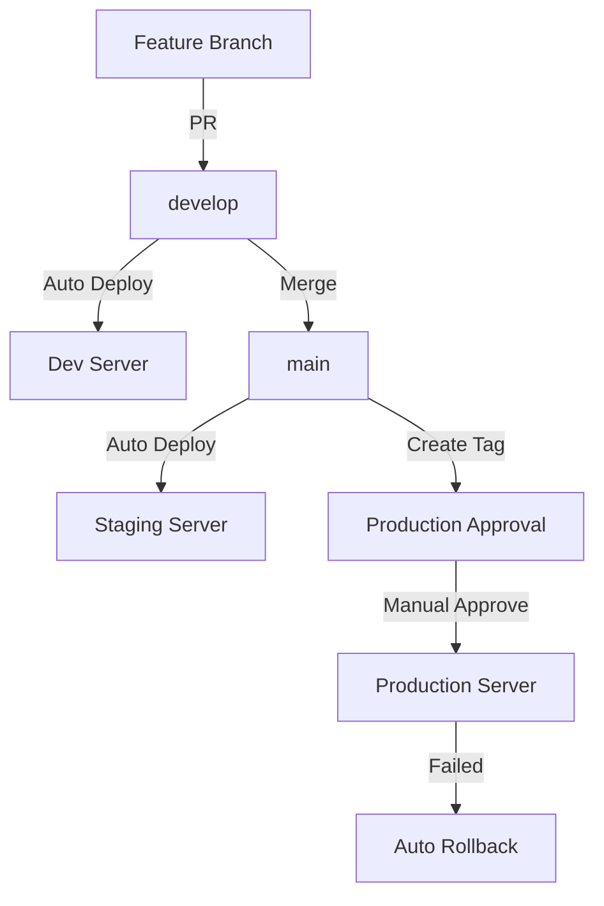

# Stock-Simulator CI/CD

[](https://github.com/YOUR_ORG/Stock-Simulator/actions/workflows/ci-backend.yml)
[](https://github.com/YOUR_ORG/Stock-Simulator/actions/workflows/ci-frontend.yml)
[](https://github.com/YOUR_ORG/Stock-Simulator/actions/workflows/security-scan.yml)

완전 자동화된 CI/CD 파이프라인으로 개발부터 프로덕션 배포까지 간소화합니다.

## 🚀 Quick Start

### 개발 환경 배포
```bash
# develop 브랜치에 푸시하면 자동으로 Dev 서버에 배포
git push origin develop
```

### 스테이징 배포
```bash
# main 브랜치에 머지하면 자동으로 Staging 서버에 배포
git checkout main
git merge develop
git push origin main
```

### 프로덕션 배포
```bash
# 버전 태그를 생성하면 수동 승인 후 Production 배포
git tag -a v1.0.0 -m "Release v1.0.0"
git push origin v1.0.0

# GitHub Actions에서 승인 대기
# → Actions 탭에서 "Approve" 클릭
```

## 📋 워크플로우 개요

| 워크플로우 | 트리거 | 환경 | 자동화 |
|-----------|--------|------|--------|
| CI - Backend | `backend/**` 변경 | - | ✅ 완전 자동 |
| CI - Frontend | `frontend/**` 변경 | - | ✅ 완전 자동 |
| Security Scan | Push, PR, 스케줄 | - | ✅ 완전 자동 |
| Deploy Dev | `develop` 푸시 | Development | ✅ 완전 자동 |
| Deploy Staging | `main` 푸시 | Staging | ✅ 완전 자동 |
| Deploy Prod | `v*.*.*` 태그 | Production | ⚠️ 수동 승인 필요 |
| Rollback | 수동 실행 | All | 🔧 수동 |

## 🔄 배포 흐름



## 🛠️ 환경 설정

### 필수 GitHub Secrets

```bash
# SSH
SSH_PRIVATE_KEY              # 서버 접속용

# Servers
DEV_SERVER_HOST              # dev.example.com
STAGING_SERVER_HOST          # staging.example.com
PROD_SERVER_HOST             # production.example.com

# Notification (Optional)
SLACK_WEBHOOK_URL            # Slack 알림
```

**상세 설정 가이드**: [CI/CD 가이드](doc/CI_CD_GUIDE.md)

## 🔒 보안 스캔

매 푸시마다 자동으로 실행되는 보안 검사:

- ✅ **Trivy**: Docker 이미지 취약점 스캔
- ✅ **OWASP**: Backend 의존성 검사
- ✅ **npm audit**: Frontend 패키지 검사
- ✅ **CodeQL**: 정적 코드 분석

결과는 **Security** 탭에서 확인 가능합니다.

## 📊 모니터링

### Grafana Dashboard
- URL: http://localhost:3001
- 로그인: admin / stocksim123
- 대시보드: "Stock Simulator - Services Overview"

### Prometheus
- URL: http://localhost:9091
- Targets: http://localhost:9091/targets

## 🔙 롤백

### 자동 롤백
Production 배포 실패 시 자동으로 이전 버전 복구

### 수동 롤백
```bash
# GitHub Actions에서
Actions → Rollback Deployment → Run workflow

# 입력:
- Environment: prod
- Version: v1.0.0
- Services: all
- Reason: Critical bug in authentication
```

## 📚 문서

- **[CI/CD 완전 가이드](doc/CI_CD_GUIDE.md)** - 상세 설명서
- **[프로젝트 구조](doc/모의주식게임_개발로드맵.md)** - 개발 로드맵
- **[인프라 구축](doc/인프라_구축_진행상황.md)** - 인프라 상태

## 🐛 트러블슈팅

### CI 빌드 실패
```bash
# 로컬에서 테스트
./gradlew test  # Backend
pnpm test       # Frontend
```

### 배포 실패
```bash
# 서버 로그 확인
ssh user@server
docker logs stockSimulator-api-gateway --tail 100
```

### Health Check 실패
```bash
# 서비스 상태 확인
curl http://localhost:9832/actuator/health
curl http://localhost:8761/eureka/apps
```

더 많은 해결 방법: [CI/CD 가이드 - 트러블슈팅](doc/CI_CD_GUIDE.md#트러블슈팅)

## 🎯 모범 사례

### 1. 브랜치 전략
- `feature/*` → `develop` (Pull Request)
- `develop` → `main` (충분한 테스트 후)
- `main` → `v*.*.*` (Stable release)

### 2. 버전 관리 (Semantic Versioning)
- `v1.0.0` → Breaking changes
- `v1.1.0` → 새 기능
- `v1.0.1` → 버그 수정

### 3. 배포 타이밍
- ✅ Development: 언제든지
- ✅ Staging: 업무 시간
- ⚠️ Production: 낮은 트래픽 시간대 (금요일 오후 피하기)

## 🤝 기여

CI/CD 개선 제안은 환영합니다:
1. Issue 생성 (Label: `ci/cd`)
2. Feature branch 생성
3. Pull Request 제출

---

**CI/CD 문의**: GitHub Issues  
**긴급 장애**: Slack #devops-alert

**Last Updated**: 2024
